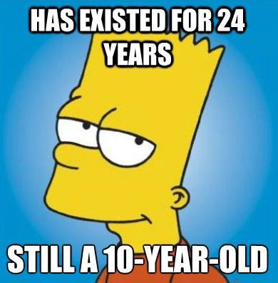

My mom has a friend named Kate. She is a wonderful woman in her 60’s. Unfortunately, she lost her husband to brain cancer a few years back. Since then she’s been living alone in a condo close by to my parents. They see each other quite often and have a great relationship.

I saw her the other day and wanted to use the opportunity to ask her some questions regarding diabetes. I wanted to ask her about the medication she takes and the difficulties she faces. To be honest, I also secretly wanted to let her know about [Dr. Jason Fung](https://idmprogram.com/) and how he reverses diabetes (He’s one of my online heroes).

To my surprise, when I brought up his treatment program, she cut me off and refused to listen. I was surprised (to put it mildly). “Why would you not want to know” I asked her? He literally reverses diabetes in his patients. How could anyone refuse that?

Her explanation was quite thought provoking. She told me that in all honesty, she doesn’t know how long she has to live. She doesn’t want to spend her last remaining years fasting, and worrying about everything she eats. She wants to be able to go out and have a good time. If she was 20 years younger and her husband was still around, things would probably be different.

Now, to be clear, I fundamentally disagree with her. I think she has it completely backwards. By taking care of her health, she could live her remaining days well and truly enjoy them. Also, most likely, she’ll have more of them to enjoy.

But then I started wondering if she was right too. Was I only saying this because I am half her age. Would I be thinking this way when I’m 60 too? I sure hope not.