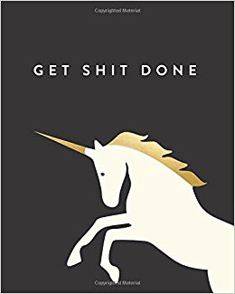

Do you know how some times you read or hear things that just blow your mind? They resonate with you so much you just feel inspired. They make you want to print it out as an inspirational poster and plaster it on every room in your house as a reminder. They are one of those great #LifeLessons.

I’ve had many of those moments. One in particular that I still refer to often is

> The sooner you do something, the longer you get to enjoy it

I found this statement as part of another blog that I can’t remember anymore but it really resonated with me. I read it and realized that everything I’ve been delaying could be done right now and I’ll get so much more time to enjoy it.

It even lasted for a few days. But just life everything else in life, things got quickly in the way and I fell back to my old procrastinating habits. How could this be? Don’t I want to enjoy the outcome? Of course I do. But who ever said procrastination was logical in the first place.

Recently though, I’ve been experimenting with a whole new technique. The idea is very simple. Just do the smallest, littlest step you can to move things forward. For example, I have a garden that I wanted to build in my front yard for about a month now but I haven’t really done anything about it. I have a lot of great reasons as to why I haven’t done it. I come after work and it’s already dark. I have more pressing things to do. Etc.

So what’s the minimal step for me to get this going? Take out the shovel from the back of the house. That’s it. Nothing else. Next step tomorrow is to dig out one small portion of the grass. Nothing complicated and no back breaking work. It shouldn’t take more then a minute to do.

My guess is I won’t stop at one hole and I’ll continue for a while. Tomorrow we’ll see.