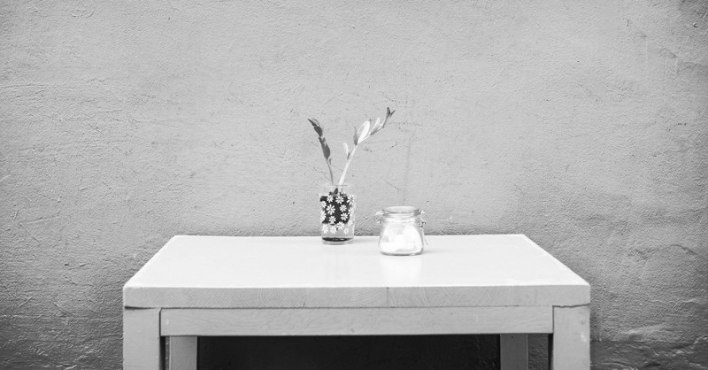

My wife and I spent this past weekend cleaning up the house. This is not glorious work but needs to be done. In the past, this would have been a pretty miserable experience for me. Going through the house room by room, looking through all my shit and putting it back in it’s place just didn’t seem to be all that interesting. I could probably come up with two dozen better things to do.

These days I feel a little different about it. I actually enjoy cleaning. I love going around the house and putting things back in their place. I love finding things that I don’t need and tossing them out. Have I lost my marbles? What’s with the change of heart?

What happened is, I discovered minimalism. Specifically, I discovered “[The minimalists](https://www.theminimalists.com/)” and [Marie Kondo](https://medium.com/u/7c19949c6acd). I can’t tell you enough about how great it is to sit in a house where all the dishes are clean, the books are on the book shelf and your clothes are in the closet. The room is spacious and calm and you don’t feel the anxiety that comes with disorganized room. Simply can’t recommend enough!