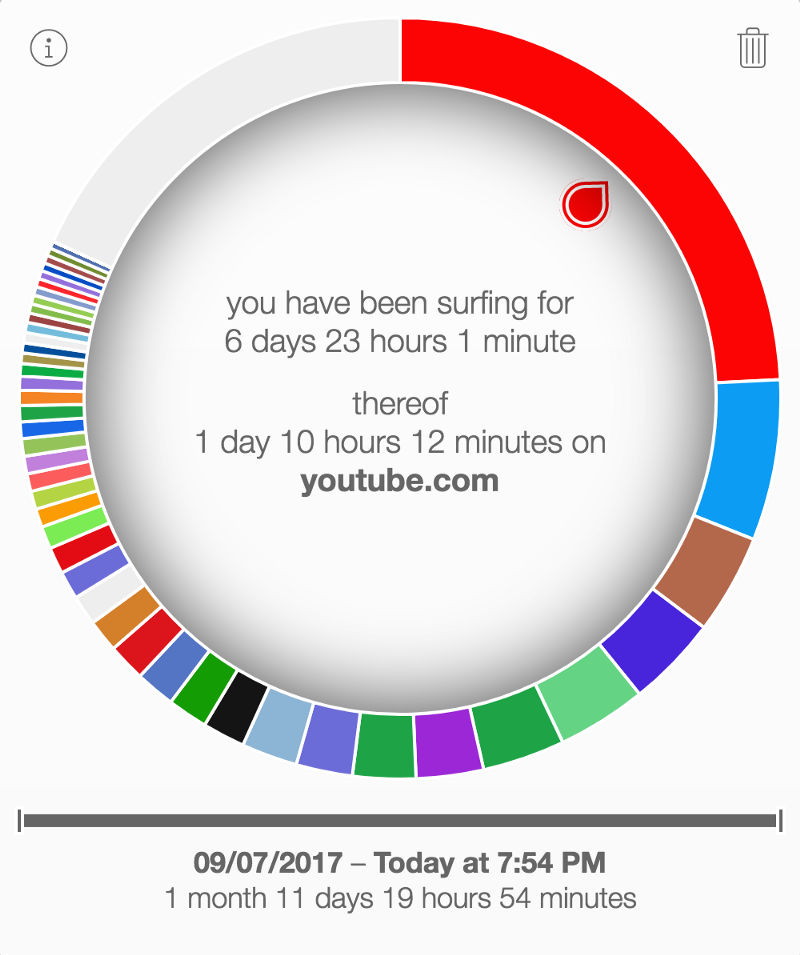

About a year and a half ago I discovered the x1.5 speed feature on YouTube and my world has been changed forever. No more would I have to suffer through slow talking TED talks or horribly paced tutorials on trivial matters. It’s really been a godsend for my learning. In fact, check out my YouTube viewing as a percentage of my overall surfing:

That’s almost a quarter of all my surfing!! Second in it’s place is Twitter which I’m not as proud of.

Now for the longest time I felt reasonably good about this. I always justified this behaviour by saying that this is for learning. I was technically wasting my time because I was constantly learning something new. This is actually true. There was no way I could consume as much content otherwise.

Recently though, my wife brought up the objection that if I keep watching my videos on x1.5 speed, I’ll rewire my brain to expect everything to be done that way. I’ll start talking faster; I’ll expect other to talk faster; and most importantly I’ll have a lot less patience.

Initially, I tried to tell her that it is fine because I only watch informational videos at x1.5 speed and entertainment is still at regular speed. I was just trying to pick up facts. Therefore; there was no need to slow it down. Additionally, I didn’t feel like I really had a problem and could easily slow it down and just watch less videos.

So I tried it. Today. I switched back to normal speed and played through some of my regular subscriptions. The first thing I noticed is how slow everyone seemed to talk. In fact, there were some people I’ve never even heard talking at a normal rate before.

The second thing I noticed was how hard it was sometimes to just keep listening. I had this urge to do something while they were explaining. It felt like they just couldn’t quite get to the point fast enough for my liking. I’d find myself skipping ahead a few times just to realize I missed some content and then having to backtrack.

Finally, when I got more accustomed to the speed, I realized how calming it is to listen to someone talk at a regular speed. No one was rushing anywhere and the world wasn’t on fire. They were just saying what they wanted to say and I was an observer.

I think I might still reserve the x1.5 speed option for certain things. Maybe I’ll do it for technical presentations or something that tends to be extra boring. But the general rule for me now is to listen to people talk they way they intended to be heard.