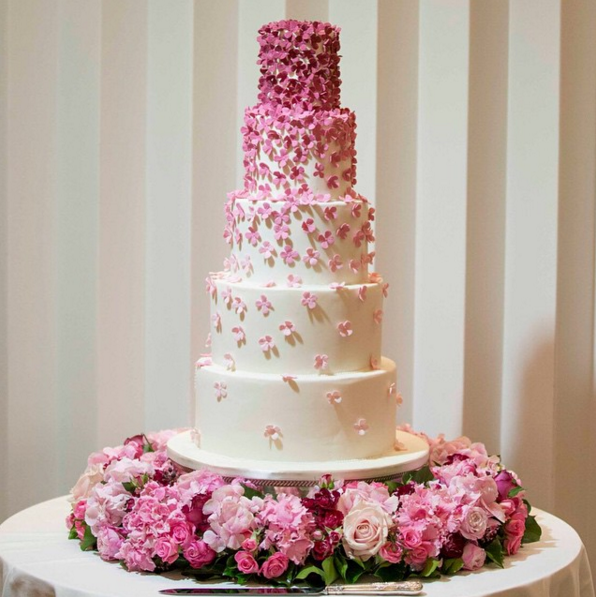

This isn’t really about weddings in particular but they are a good example of a phenomena I just picked up on. It’s the phenomena I would describe as irrational under-appreciation of money. I would love [Dan Ariely](http://danariely.com/)’s opinion about this.

Here’s a scenerio: You’re planning your wedding. Your partner is going through all the little things that need to be done. You, as the financially savvy “finance guy” add up all the costs and realize this wedding is going to cost you roughly $15,000.

Now, we all know that [money is time](https://medium.com/@osportfolio/am-i-chasing-money-a59a1b636cb1) so a better question is, how much time is it going to cost you. You do the math and after the costs of working, commute, unwinding and the additional wardrobe you maintain, you take home roughly $10 an hour in savings so about 1500 hours of work. You bury your face in your hands and start crying.

This analysis is probably more then what 99% of people do when they make buying decisions. This is probably too much to really expect from most anyway. Plus I don’t think anyone would really want to do such an analysis each time they are about to buy coffee.

So how about a much simpler analysis. Take a purchase in your life that you think was a great decision. For example, I recently bought a roundtrip ticket to Ghana for roughly $1200 and figure out how many times you could do the same trip using the money you’re about to spend. This way, you’re not dealing with abstract figures but actual valuable human experiences (or things).

In this particular example, you could probably visit Ghana 14 times instead of having this extravagant wedding. So ask yourself this question, is this wedding worth 14 trips to Ghana. Of course, for that amount, you could probably visit all of Africa.

The idea is to equate it to something a little more concrete then just dollars so you grasp the value that you’re dealing with. I find that otherwise, the numbers are too abstract and throwing around $5000 is just as easy as $10,000 without realizing that you just doubled your cost.