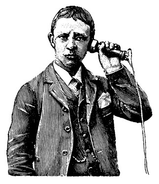

One thing that I try to avoid when I’m around people is to stick my face in my smartphone. Another thing that I try to avoid when I’m **not** around people is to stick my face in my smartphone. In general I don’t like the idea of spending my precious life minutes looking at electronics.

Now, obviously it is unavoidable to some extent. It is mandatory in my line of work. It is also necessary to write this piece. But Ideally, if it’s not necessary, in a perfect world, I would have the phone somewhere far away.

To some extent I’ve been reasonably successful. I keep my phone charging in the bedroom when I get home. I also removed all social media apps so I don’t spend time pointlessly scrolling through feeds of food, cats and random vacation pictures.

One of the most powerful things I’ve managed to do though was to turn off notifications in most of my apps (that tend to notify). For example, email, Whatsapp and the like. I found that my anxiety level around my phone has decreased dramatically after that. The cost of doing that is of course you might not reply to a message immediately.

Now, I’m far from perfect and I still find myself looking at my phone more then I would like. I still check my email too often and still stick around on the toilet longer then I should just because I’m browsing the news. This isn’t a behaviour that I’m proud of but I’m working on it.