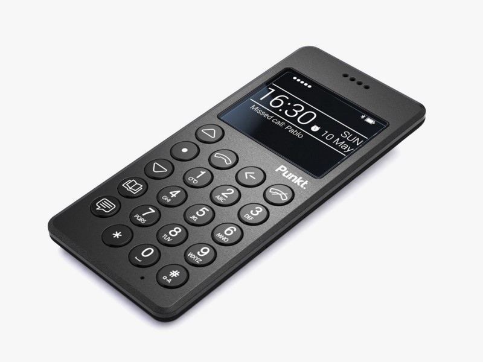

As a follow up to the [previous post,](https://medium.com/@osportfolio/dumb-it-down-bb81397eaacc) one more “extreme” thing I’ve been considering for a while was to switch completely from a smartphone back to an old school dumb phone. I find the idea very attractive. And it seems [I’m not the only one either](https://www.punkt.ch/en/products/mp01-mobile-phone/). It will ensure that my phone usage decreases dramatically while still giving me a way out in case I’m in trouble or if someone is looking to reach me.

The problem is that dumb phones are missing certain key apps that I rely on heavily. For example, I like having Google maps for orientation. I mentioned this idea to my wife and to my surprise she questioned my basic assumptions. She asked me when was the last time I was suddenly lost. Could I not look up my path prior to going there and print out the directions? You know, like we used to do.

That’s a valid point. I think I like the idea of having maps a lot more then I actually need them. I’m certain there’s very few instances that I suddenly needed them because of some unforeseen circumstances. So what’s really holding me back?

Another thing I could think of was various messengers I use to communicate with my friends around the country. That one is a little tougher since everyone have their messenger of choice and platform fragmentation isn’t helping the situation. At any one time I have 3 messengers running to talk to different groups of people. I’m not trying to claim it’s unsolvable problem but it’s definitely inconvenient.

In her eternal brilliance, my wife asked me, what was actually bothering on my smartphone? In other words, what was I spending most of my time on? I admitted that it was email. I like to check it far more often then I should. So she dropped this bomb on me:

> Why don’t you uninstall it?

