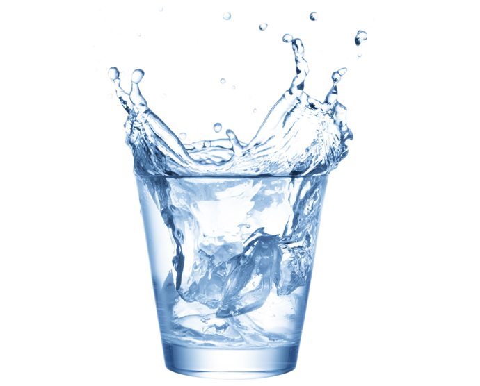

I’ll start off by admitting that it isn’t really a law. Nor is it second since I’ve never established the first one. It’s more of an observation that I had recently regarding minimalist living and why it works.

Now, you’re probably vaguely familiar or remember the idea of the second law of thermodynamics. To summarize it in a non-sciencey way, it’s essentially the idea that things tend towards disorder unless outside energy is applied. A good example of this is taking a bath. Initially, it is all nice and hot but after a while you realize the water has cooled down because the heat has escaped.

So what does that have to do with minimalism? I think you can draw a neat parallel between thermodynamics and ownership of things (or obligations). It’s also a great way to better understand two things

1.  Why are you unhappy with everything you have
2.  How can having less possibly make you happier

Let’s imagine yourself owning a very basic set of dishes. You have nothing beyond a single plate, knife, fork and spoon. Also, washing dishes isn’t exactly your favourite activity. Life is pretty tough. What can we do to improve it?

One thing we can do is add a cup. Now you’re able to enjoy water comfortably instead of trying to collect it in your hands. Sounds pretty great no? Your happiness should improve dramatically. I have no doubt that drinking water without a cup is adding a lot of unnecessary inefficiency to your life. This is also the overall thought process that people go through when determining if they need to purchase something or not.

But there’s one thing we’ve overlooked. We forgot to account for the cost of maintenance for this item. I use maintenance as a general form to refer to actions like storing the item, washing the item and finding the item. All trivial indeed but don’t forget, all we have is one set of everything. In this case, the trivial maintenance cost is just that. Trivial.

Maintenance becomes a problem as the number of items that you own increases. Each of them providing a diminishing return for your convenience but increases the maintenance somewhat linearly. For example, getting another cup would mean another person can have a drink with me but all the above maintenance costs just doubled.

This maintenance cost comes to us in two primary forms. The first is at the cost of our time. We have to spend time washing the cup and putting it away. But also, it comes in the form of mental clutter. This will arise when you don’t take care of the maintenance tasks immediately and they start pilling up.

You can extrapolate this further to all the items that you own. And you own A LOT. Like thousands a lot. Each may take 1–10 seconds in maintenance on average so together it takes a significant chunk of your day. And before you realize it, you spend a significant portion of your free time just putting things back together, finishing up unfinished projects and just basic cleaning. No wonder you don’t have any time.

The second law of minimalism is this:

> Everything has it’s cost. Make sure you understand it well