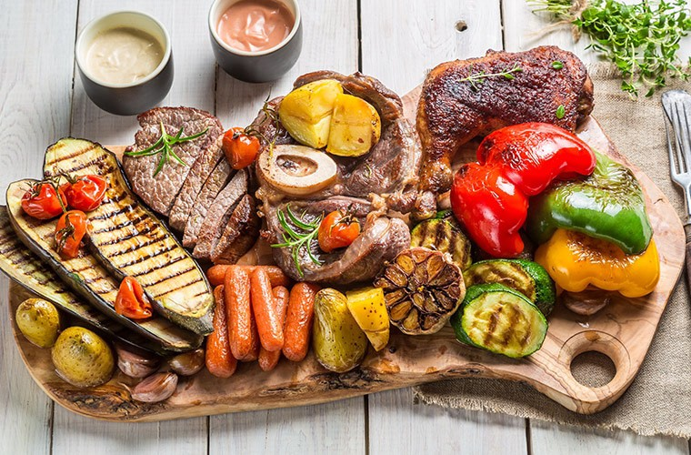

Since I’ve been harassing everyone regarding their food choices for the last couple of months, a few people started asking me for my overall dietary views. I don’t think they are necessarily looking for a comprehensive explanation of how insulin is related to heart disease but a simple list of dos and don’ts. This should hopefully clarify my current standing.

Let’s start with the don’ts.

1.  If you’re consuming sugar then stop. It’s just bad for you. Throw it out or burn it. Up to you.
2.  Cut out all the grain and legume products from your diet. That includes rye, quinoa barley and buckwheat. I’m sure you eat a ton of that don’t you? Oh yeah, and wheat. That includes pasta and bread, whole wheat, whole grain, ancient grain and white. Sorry.
3.  Stop eating low fat garbage (Anything meant to be full fat but is low fat is defined as garbage).
4.  Eliminate vegetable oils from your diet. That includes common ones like Canola, soy, and safflower.

And now the dos

1.  Replace all the foods you’ve eliminated so far with vegetables. That includes a lot of leafy greens.
2.  Replace eliminated oils with olive, coconut, or avocado oils.

That’s about it. Pretty easy right?