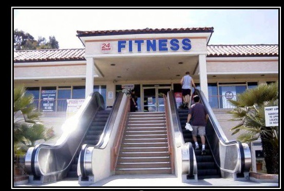

One of my internet heroes, Mr. Money Mustache, wrote a very popular article back in 2013 titled “[Curing your clown-like car habit](http://www.mrmoneymustache.com/2013/04/22/curing-your-clown-like-car-habit/)”. It’s a great read and I highly recommend that you open it in a new tab and read it later :-) Fun fact, it is also the post that got me hooked on his blog.

Yesterday I think I managed to identify another set of clowns. I call them escalator clowns. I’m not going to claim that this term is invented by me. I imagine some people on the interwebs have used it before. However, I think we all know who I’m talking about.

I’m not claiming that anyone who ever takes the escalator is an escalator clown. There’s plenty of good reasons to take the escalator. You can have bad knees for example. You may have a child with you who loves to ride the escalator. There might not even be an alternative such as stairs.

However, if you eliminate all of the options from above and you still decide to take the escalator, you’re not yet an escalator clown. To turn into an escalator clown, you have to take the escalator and then consciously just stand there. That my friend, makes you a clown.

I just don’t get it. Why would anyone just stand on an escalator? Escalators are slow. People looked bored. There’s nothing pleasant about it. The only reason I can fathom is you must be conserving energy (because you’re starving). Why else would you just stand there and wait? Also, you get two clown points if you’re heading down.

I ran into this phenomena on my way home from work. I was walking out of an office building and speeding my way towards the exit door when I walked past a lovely lady on the escalator. She turned her head and looked at me with a surprised look as I kept walking (and she was standing). To be honest, I don’t know what was the cause of the surprise. It might have been my mere presence.

However, I know one thing for near certainty. She was leaving home from her office job. Office jobs tend to be sitting jobs. Her one solid opportunity to stretch those legs just opened up and she decided to squander it anyway. By no means is she the only one. I see this daily. And you probably do too. You can’t tell me all these youngish people have bad knees. So here’s a life lesson for you:

> Don’t be an escalator clown. Don’t stand to the right. Just walk.