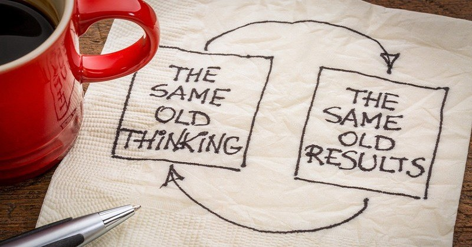

Yesterday I hosted a bunch of my friends at my house and we ended up in a long discussion about having children, age and work. Nothing unusual so far and that’s more or less what you’d expect people our age to talk about. It was a great night and it was nice to catch up with everyone. While talking specifically about children and inquiring about why anyone wanted them, one thing that was brought up very casually and without much resistance from the rest of the room was the idea that they will be there to teach you things. Sort of the way I do with my mom and you do with your mom and dad.

Now, there’s absolutely nothing wrong with learning from your kids. If my kid ends up being a surgeon, I would love to get her opinion about all sorts of health related issues. After all, she has medical training and I don’t. But despite their denial, that was not what my friends were trying to say at all. Instead, it was this underlying assumption that once you got old, you’re just not expected to perform well. Both mentally and physically. And it’s normal. If I was to challenge that idea, obviously they’d deny it but you could tell this was the assumption going into the conversation based on the context and where it was going.

I’m not going to pretend that once you hit 30, you are not less likely to make it to the NBA if you haven’t yet. There’s definitely diminishing physical abilities after a certain age (with very notable exceptions). But what bothers me is the lack of any sort of attempt to compensate for that. If you’re worried about your physical performance as you hit 50, why not double your gym time instead of just throwing your hands up in the air and say “that’s just the way it is”. I guarantee you there are people double my age who can bench press twice my weight. They just have a different attitude.

Similarly, I think that people that expect less mentally from older people, will expect less from themselves when their older. In turn, their abilities to understand and learn will quickly diminish with age. On the other hand, there’s older people who are still brilliant and who are able to maintain their mental clarity until their last day. What makes them so different? I think to some extent it’s their attitude.

That’s exactly the kind of attitude I want to cultivate in myself. I don’t think that when I’m 50 I’ll bench press less. I think I’ll bench press more. When I’m 50, I won’t be taking 10 pills a day. I’ll take none. I’ll feel great and I’m sure of it. I just need to make sure that I take care of myself now. This is the kind of attitude I would expect everyone to have.