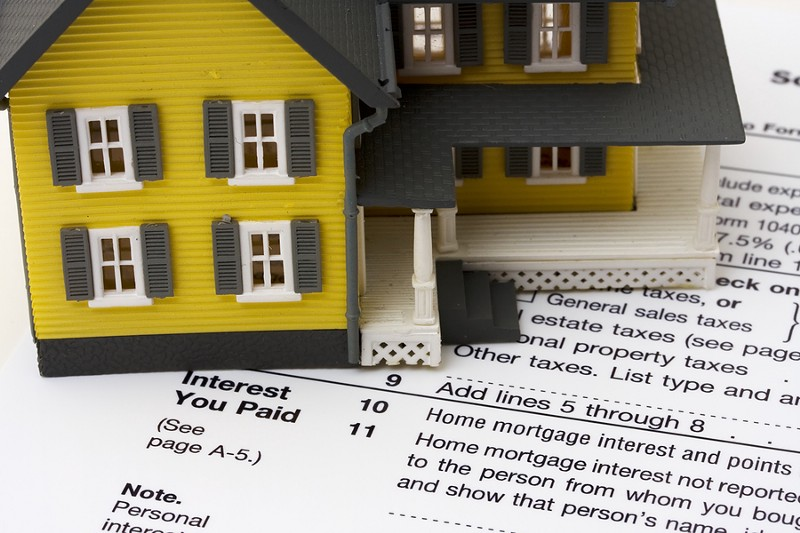

As some of you know, to stimulate home ownership in the United States, the government created a scheme where by you get to deduct the interest portion of your mortgage payments from your income to reduce it for tax purposes. Effectively, this means that the interest is paid using pretax dollars. Great! let’s all go buy houses.

Not so fast. Take anyone with any sort of economic sense and they will tell you there is no free lunch here. You’re not getting stuff cheaper. By subsidizing the payments, the government simply pushed the prices of housing up for everyone. If you don’t believe me, answer this question: What do you think would happen if this was taken away now? If you said people would freak out and the prices would fall because payments are higher then reverse this argument.

Alright, so we know governments generally can’t get shit right and a lot of policies are misguided. Does that mean this one is also just a big fat waste of money? That’s sort of what I thought. At least until yesterday. Yesterday, I watched this video:

There were a couple of interesting points of conversation there. One in particular that caught my attention though was regarding this exact topic and your level of taxation. You see, since every owner gets to take advantage of this particular piece of policy, they save at the same rate as their marginal tax rate. On the other hand, the amount that this house went up in price due to this particular policy is roughly equal to the overall average marginal tax rate in the United States.

So what does that mean? That means that if you are at a higher margin tax rate then the average population, you’d save money based on this policy. If you’re in a lower tax bracket, you lose. The only additional point I’d like to make is that it is probably the average margin tax rate of an average house buyer. The poorest citizens probably keep renting.

> So this entire policy is not only making housing more expensive for everyone, but it is oddly also a subsidy for the rich by the poor.

I’m not talking about tax cuts here that are great for everyone but happen to benefit the rich more (due to their larger tax bill in the first place). This is literally a transfer from the poor to the rich.