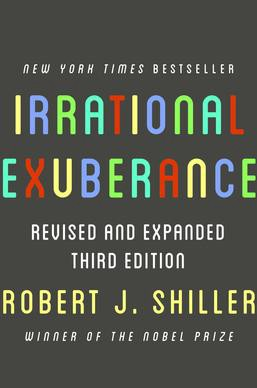

I was at a friends house the other day. We sat down for a chat about life and work when his grandmother decided to walk into the room. She joined us at the table and then looked at me with excitement. “Have you heard of BitCoin?” she asked. She then followed that with “I heard it’s an opportunity of a lifetime. You can be rich. Quick!”.

Now this story is totally made up but the lesson here is not to be missed. As a rule of thumb, if everyone is talking about some amazing investment opportunity, it’s probably already too late to make real money. This includes houses, gold, stocks or whatever fad comes next. This isn’t to say that you can **never** make money. You definitely could! But you have to be aware that at that point it is just a gamble.

The reasons for this argument are a bit complex but are discussed at length in the book “Irrational Exuberance” By [Robert J. Shiller](https://en.wikipedia.org/wiki/Robert_J._Shiller). He has a Noble prize so he’s got to be on to something. The gist of it though is that humans are very much like cattle. We learn from each other and we follow each other. We’re also very prone to create market bubbles and over evaluate assets due to that herd mentality.

One other reason that I think people end up with bubbles that’s not as frequently discussed is that it’s plain exciting. People love winning. I have a few colleagues who have made several thousand dollars off trading crypto-currencies. They love talking about them and which one is growing at what rate or what high it hit. However, since pretty much all the major crypto-currencies are up, it’s hard to not make money over the last few years. You don’t need any special skills. Although that’s probably missed by them.

Also, I can’t help myself but see the parallels between this and **every single other asset bubble in history**. I’m talking about gold a few years ago, housing before that, and tech before that (and probably now). Every single time it ends in tears and the witch hunt starts for who mislead the public.

This article is going out on the interwebs for my millions of readers to see. That means that a few years from now someone could be reading this as they are paying their rent with some tiny fraction of BitCoin and laughing at my conclusions. I am well aware of it. This could be an absolute revolution in our financial system. And that’s great. Until then, I’m keeping my money in a well diversified index fund.