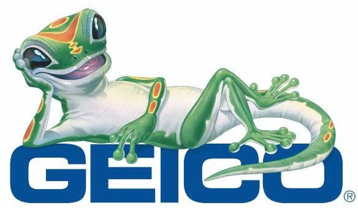

This is highly inspired by an article from Mr. Money Mustache titled [Insurance: A Tax on the stupid](https://www.mrmoneymustache.com/2011/06/02/insurance-a-tax-on-people-who-are-bad-at-math/) and I found it to be quite influential for my way of thinking about insurance. The premise of the article is simple. Insure only the things you cannot afford to lose. Pay up for the rest because in the long run you’ll save money.

This makes perfect sense as well. Take any insurance company as an example. It exists for the sole purpose of making money. It does this by paying out less then it brings in. That means, the risk that it’s covering must cost less in the long run then what it charges for it in premiums. I think no one would argue against this idea.

Humans have two major flaws when it comes to losses. The first is that we seem to feel twice the amount of pain for a loss then an equivalent gain. Putting this in dollars is the easiest way. You’d feel twice as much pain for losing $100 then the pleasure of gaining $100. This is completely irrational but that’s just the way the mind works. It is called [loss aversion](https://en.wikipedia.org/wiki/Loss_aversion).

The second flaw is that we are really bad at estimating probabilities. Especially when these events are extremely unlikely. That’s why we have irrational fears about dying in a plane crash but aren’t worried what so ever about heart disease. Yet the former kills a tiny fraction of the latter.

So given these two flaws of human behaviour, we can now see why insurance becomes a bad deal. An insurance company knows roughly how likely houses are to burn down or your electronics getting damaged. With a large enough pool of people, they can calculate the risk reasonably well and then distribute it over many premium payers. In fact, since we over estimate the likelihood and the pain of loss, they can charge us significantly more for it.

The other issue I have with insurance is that people seem to insure absolutely everything of any moderate value. For example, people buy extended warranty on their TV’s and phones. They buy extended coverage on their cars. They insurance their pets. Etc. So what’s the problem?

> The problem is that it’s generally a big waste of money.

Not only are you making money for the insurance companies but also it’s extremely silly to insure something you could afford to repurchase without thinking twice about it. If someone dents my car and I felt the need to fix it, I could pretty easily afford to do it and never think about it again. I wouldn’t bother going to the insurance company for it.

So the general rule of thumb is very simple. Buy insurance only if you cannot afford the replacement or the bills to fix it. For example, if my house burned down and I needed to rebuild it, I could not afford it. Thus; I insure my house. On the other hand, my deductible for my insurance is set to the maximum because I can afford to pay for it out of pocket.

And if you stop to think about the purpose of insurance, you’ll realize that is there to cover you in case of a catastrophic events. It is not there to save you $20. Dropping your flat screen TV on the floor is not a catastrophic event so buying extended insurance is plain dumb. Unless of course it is in which case buying a flat screen TV is plain dumb.

There’s one other situation that you can justify buying insurance for. It is very specific and you’re unlikely to run into but I feel I should mention it anyway. It is the time when you have some additional information that the insurance company doesn’t that significantly increases your risk. For example, let’s say you’re extremely shitty driver but you’re getting a great quote from GEICO. If you have a really good reason to believe that the insurance company is underestimating their risk significantly, go ahead and insure. But That’s unlikely to be true and the gain is probably not very significant.