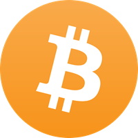

Friends have been asking me for weeks about what I thought of this promising new investment opportunity. I promised them a blog post was coming and [delivered it](https://medium.com/effai-me/make-it-rain-with-bitcoin-clickbait-218a528a85b1). Since then, I’ve done some more reading about the concept and would like to clarify a few stances.

Before I do any clarification, I just want to say that I think the idea is actually very interesting. It is modeled after gold and assumes certain positions on the economy and prosperity. The libertarian in me definitely likes where this is going.

One error that I made when reading about Bitcoin was the assumption that all transactions are completely anonymous. I was under the impression that you can transfer money between two consenting adults and the government cannot politely place their noses in your business and ask for a cut. However, that’s not the case.

Either way, the idea of modeling it like gold is very intriguing. Every so often, when a conversation turns to money, someone looking to sound smart will state some sort of an opinion about how today’s money is “fiat currency” backed by nothing but thin air and promises. In the good old days, we had the gold standard so each dollar was worth something.

As the video above points out around the 50 second mark, the gold standard does not mean that money is backed by anything either. Gold is just a convenient way of figuring out who owns what and who owes who. It is like a ledger where we write down all the transactions.

> Gold isn’t valuable because we make jewellery out of it. It’s the other way around.

As it turns out, good forms of money (such as gold) have 5 properties.

1.  **Scarcity — **Gold is pretty hard to find
2.  **Fungiability —** Any gram of gold is equally valuable
3.  **Divisibility —** You can subdivide gold into smaller pieces to pay for cheaper things.
4.  **Durability — **Gold is a noble metal. Does not react under most extreme weather conditions.
5.  **Transferability — **Exchanging gold coins is reasonably easy and been done for thousands of years.

Bitcoin meets all of the criteria above and some would argue exceeds these criteria relatively to gold. Does it mean it’s time to remortgage your house and go all in on Bitcoin mining like your Uber driver told you? Not quite. There’s 4 big problems that I see with the current state of crypto-currencies.

**It’s not an investment.** The view that Bitcoin is an investment seems to be the most dangerous to me although it’s a widely held belief. To be fair, it’s hard to argue with results. If you held Bitcoin from 2010 to today you’d be a Zillionaire. Naturally, the typical precautions apply. “Past performance do not guarantee future results”.

However, I’m mostly referring to the word “investment”. I don’t think it should be used in this case. The reason is that an investment implies some sort of return due to added value. For example, you invest in stocks because you get to own a company that presumably adds value over time. Added value leads to bigger profits. Bigger profits lead to dividends and as a share holder you have a claim on those dividends. Similarly, we invest in real estate because we count on the rental income. We provide the valuable service of shelter and to thank us, the renter hands us dollars.

Where is the value being added when you store your dollars in the form of Bitcoin? There’s none actually. It’s just a commodity like gold. You may argue that it’s a store of value. You can make an argument that it’s a hedge against inflation (assuming it ever stabilizes in price). But there’s definitely no added value there so it’s not an investment.

And it isn’t just semantics. Something that is not an investment but you still risk money on to make more money sounds a lot like a gamble. I think that if everyone treated it like a gamble, the results wouldn’t be nearly as exciting. The pundits on TV would have to quiet down and the small talk at dinner will have to shift back to real estate (because that’s what we did before Bitcoin).

**Investors have no clue how it works.** We were having a social gathering the other day. Once we were done talking about Trump for the night, the conversation obviously shifted to Bitcoin. Two of my friends wanted to know what I thought of the idea and if they should invest in it. We started talking about some fundamentals of money and investing when it dawned on me; I was standing next to two world class software engineers neither of whom understood how crypto-currencies worked. Neither did I. However, they were ready to put down thousands of dollars into this “investment”.

A week later I am chatting with another friend over coffee when he pulls out his phone to show me his portfolio. He has huge gains. Over 80% in just a month. Turns out he invested in 20 different crypto-currencies. However, when I asked him what percentage of the tech he understood, he admitted that it was roughly 0.5%. I appreciate the honesty but worried of the implications.

To be fair, this is anecdotal but I have a feeling it’s much more wide spread than many realize. Personally, I would never dream of investing in a company without ever knowing at least what they do and looking at some financial ratios. However, in this case, at least in some limited examples, it seems like the default approach is to buy now and figure it out later.

**It’s actually not that useful.** This reason is most up for debate but I think it’s also going to be the most influential. For a currency to be of any use, it must be widely accepted. Bitcoin isn’t quite there yet. Some would argue that it’s just a matter of time until it’s adopted. However, I’m wondering why? Why would anyone actually use it?

I see one use case for me. I would like to be able to transfer money internationally without paying a middle man. Some people may like to buy guns and blow on the black market. Outside of that, I’m not really sure why it would be adopted. It makes moving money marginally better but adds a lot of barriers that need to be overcome.

What I’m really saying, is that beyond the hyper paranoid consumer and the mafia Don, there’s very little added value to Bitcoin as a currency. Therefore; I must wonder why it would gain any traction as a currency versus more established ones like the USD. I’m thinking about your average consumer. The ones that make up 95% of the population.

**It can easily be competed out of business.** So there’s Bitcoin. There’s also Litecoin, Ethereum and Ripple. Three weeks ago, I introduced SuckerCoin. In fact, as of this writing, there’s **thousands** of different crypto-currencies you can trade. Crypto-currencies are built on public ideas and open source technologies. There’s very little competitive advantage any one currency has that another cannot just adopt.

Bitcoin does have the advantage that is the first and best known. However, that could easily be erased over time as others gain (or Bitcoin loses). One option companies use to maintain their competitive advantage is to lobby the government for regulations and licensing to keep competitors out. I have a hard time imagining the Bitcoin lobby passing that through congress though.

The result is that anyone can start their own crypto-currency. Some of them have even real advantages. For example, Bitcoin has a limitation on how many transactions it can process in a 10 minute block. That is addressed in other currencies. Some currencies don’t even bother with that. They just jump on the hype train. After all, a rising tied lifts all boats.

If Bitcoin, or any other crypto-currency has any chance of staying around for the long term, it must be the currency that is accepted everywhere. But with thousands of currencies, how would anyone make the right choice? Of course, you could imagine a world where everyone accepts all crypto-currencies. However, in that case, the whole scarcity idea (property #1) becomes … questionable.

### Conclusion

I think that Bitcoin is a really cool idea. Getting central planning out of our money supply is a goal worth pursuing. Bitcoin should be thought of as version 1.0 of that idea. But just like all good software, we need to keep iterating over it.

Block-chain (the general idea behind all crypto-currencies) is great. I’m sure it will be widely adopted. Maybe even for our own financial system. Maybe by our governments. Who knows? However, I’m going to stick to the tried and true. I’m keeping my money in a well diversified passively managed index fund and I recommend you do the same. More on that later.