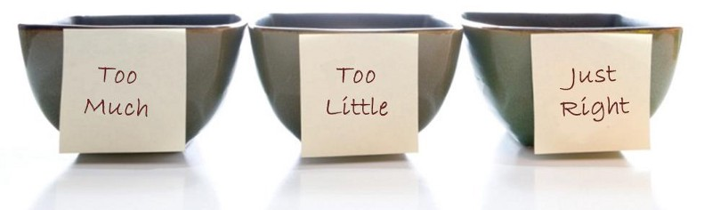

How many times has this happened to you? You’re sitting at a table with a group of friends discussing your weight loss goals. Your friend Nina wants to lose 10 pounds before her trip to Jamaica while your buddy Joseph is looking to fit into the jeans he wore last year. The topic of diet inevitably comes up. You are on that hipster low carb diet. Nina is on a strict low fat yogurt diet. Joseph is counting his calories and tracking them on [MyFitnessPal](https://www.myfitnesspal.com/).

Naturally, everyone starts sharing their theories about how to lose weight. “It’s calories in versus calories out” Joseph declares to the group. “No! pasta makes you fat” you counter. Then Nina drops the following bomb: “You just need to eat in moderation”. Boom. Case closed. We can all go home now.

### What she meant by moderation

The idea of moderation can be applied to many issues in life but to keep things simple lets continue using diet as an example. What does one mean when they say moderation is key? In the case of diet, it means focusing on a single aspect of the diet is the wrong approach. If only you did not consume anything in excess, everything else would work itself out. Naturally.

Presumably, if you were eating a balanced diet of proteins, carbohydrates and fats, you wouldn’t need to worry about how much calories you’re burning or if carbohydrates make you gain weight. Your body would just handle it automatically. This is a very common advice and seems very sensible at first.

### Problems with moderation

If the advice is sensible at first, what could be the problem? I can see at least three possible issues with it.

#### Moderation does not tell me what is moderate.

Let’s say someone is asking you what is an acceptable amount of alcohol to consume in a week. If you were to tell them to consume a moderate amount, it’s not clear at all when they’ve exceeded that moderation. Is it 2 beers a night or 2 beers a week? The difference is a factor of 7!

Another question is, moderate for what purpose? Are you trying to optimize for health, pregnancy or a 10 year old? In that case you may want to drink nilch beers. That’s vastly different from the advice you’d get from [AHA](http://www.heart.org/HEARTORG/HealthyLiving/HealthyEating/Nutrition/Alcohol-and-Heart-Health_UCM_305173_Article.jsp) for a 30 year old male in perfect physical form.

> Generally, advising moderation is somewhere between useless and dead obvious.

#### Moderation as an escape hatch.

Occasionally, you’ll be speaking about topics that are relatively complicated. If there is a lot of nuances or a lot of uncertainty surrounding these nuances, the moderation card tends to come up frequently. It is used as a way to summarize any of the uncertainties as just go with your gut.

> There’s more unanswered questions than what I’m comfortable discussing

For example, consider the topic of budgeting. Everyone has an opinion about how to budget, what to include in the budget and to what granularity. The longer you’ve been doing it, the more opinions you have. However, you’ll always find someone to tell you to spend in moderation. If you spend in moderation, you don’t need a budget.

Ask them if they’ve ever tried to budget to test if that statement is true. The answer is probably no.

#### Moderation implies normality. Normality may have shifted.

Another common implication of moderation is to not be too far away from society’s average. In other words,

> Don’t do anything society would consider extreme

However, what society tends to think is extreme is just outside of what is normal; and normal isn’t always right. For example, you could ask me what is a reasonable amount to save. If I told you to save moderately or normally, it just means saving 0 — 10% of your salary depending on where we are in the business cycle in North America.

What if instead I told you to save 50% of your salary? That would be extreme right? Wrong! First, it wouldn’t be very far away from the historical savings rates and how much people in other societies save. Second, it would be great for your household in the long term. Sticking to the average is a losing proposition in this case. However, you can’t see that through the eyes of moderation.

I am not claiming that moderation has no place in good advice. It does. Sometimes. I am saying though that you shouldn’t allow vagueness, laziness and people’s fear of judgement affect the quality of advice you dish out and receive.