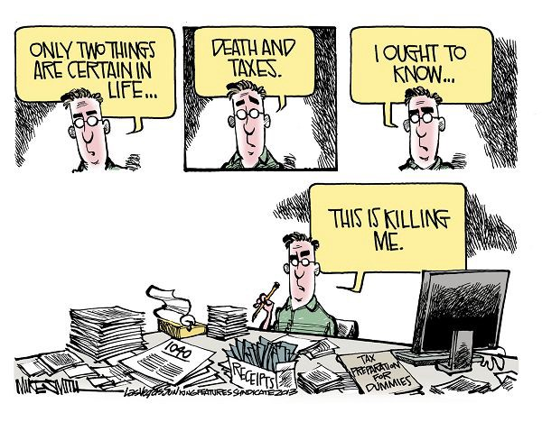

Every year, around February or March, I start dreading checking the mail. I dread it because it’s that special time of the year. It’s the time you have to gather all those illegible slips you received from your employer and enter them in to some half baked software online. As you go through the process, the dollar amount you owe/receive will swing wildly making you break into a sweaty mess. All of this is coupled with a stack of indecipherable rules handed down to you from some government entity responsible for the tax collection.

The entire mess with all the pre-tax and post-tax deductions, itemization, credits, and exemptions makes it incomprehensible if all you want to do is “pay your fair share”. Additionally, once a tax break is given, it’s very hard to take it back. Thus; we end up with 80,000 pages of IRS lawyer talk.

Wouldn’t it be great if at least you could take advantage of all these rules?

That’s why, I’m going to explore here the following question: _What is the maximum amount you can earn without paying any federal tax?_

To keep this manageable, I will make a few assumptions. First, you’re filing as a married couple. This is purely out of convenience for me since that’s how I file. If you are filing as a single person, most of the time you can just divide the number in half. Additionally, there is a pile of rules I’ll ignore for convenience. They either don’t apply to the vast majority of people or are insignificant for the bottom line. Also, I will ignore Medicaid and Social security taxes. Finally, I will ignore any possible employer contributions or matches into your retirement accounts.

Let’s start by defining a few terms.

**Pre-tax** (or traditional) — A type of deduction for which you don’t have to pay tax upfront.

**Post-tax** (or roth) — A type of deduction for which you do pay tax upfront.

**401(k) — **A retirement plan sponsored by your employer

**IRA — **A retirement plan that you pay for yourself.

**Standard deduction — **An amount every tax filer gets to deduct from their income to find their taxable income.

**Capital gains — **The tax applied on an investment

_Everything beyond will assume a pre-tax or traditional deduction. Roth deductions are for suckers. We will explore that next._

Now that we got the jargon out of the way, let’s see how we can apply it. We can start with the easiest. The standard deduction. It is $24,000 for a couple for the year 2018. If your family unit is bringing **_$24,000_** per year, the standard deduction would bring your taxable income down to $0. In turn, your taxes would be $0. Fantastic.

Next, you can contribute to a traditional IRA. The limits for traditional IRAs is $5500 per person or $11,000 per couple. Remember that a traditional IRA is a pre-tax deduction. Thus; you can earn an additional $11,000 per couple and pay $0 tax. We are now up to **_$35,000_**.

Similarly to IRA, you can also contribute to a traditional 401(k) program with your employer (if the employer is offering it). Each person has an IRS mandated limit of $18,500. Since you’re filing as a couple that gives you a total of $37,000 to deduct. Adding it to the above gives us a total of **_$72,000_** tax free dollars.

There’s one more easy pre-tax deduction left. The health savings account (HSA). This is a great choice for individuals with low medical expenses. Some highly respectable online individuals even describe it as the [ultimate savings account](https://www.madfientist.com/ultimate-retirement-account/). For 2018, the limit for a couple is $6,900. Adding that in to our total gives us **$78,900** tax free dollars.

In many cases, 401(k)’s and HSA’s come with a few more advantages. First, many employers are willing to match at least a part of your contributions. That usually amounts to a few thousand tax free dollars. Additionally, if you are 50 or older, 401(k)’s allow you to sock away another $6000 per individual. That’s another potential $12,000 to put away depending on your age.

Alright, we got all the obvious things out of the way. If you are not maximizing these, what are you waiting for?

Now let’s talk about the more esoteric options. First, there’s the 457(b). That’s a special program for government workers. If you are a teacher or a nurse or some other government worker you can usually participate in this plan. 457(b) plan has an interesting feature. Unlike other employer sponsored retirement plans, this option has a separate limit. That means you can contribute to both 401(k) and 457(b). Both also have the same limits. Therefore; if a couple works for the government, that’s an additional $37,000 that can be deducted. That would give you **$115,900** tax free dollars if my math is correct.

Of course this is not the Soviet Union. We don’t all work for the government. However, there is one other interesting way to reduce your taxes. If you went through my list of terms above, you may remember “capital gains”; the tax applied on investments. The great thing about this tax is that under certain conditions, when your investment “qualifies”, this tax can be 0 percent. You heard that right. You’ll pay nothing. The requirements are also relatively moderate. The main requirement is that your investment must be held for at least a year.

Once your investment is “qualified”, as long as you manage to keep your total **taxable** income to under $77,200, you’ll actually owe nothing to the government. Taxable is bolded on purpose. Remember that through the power of IRA’s, 401(k)’s and HSA’s we were able to earn $78,900 tax free. That’s because, for the purpose of taxation, you’ve earned $0. Now, if you were to earn an additional $77,200 from capital gains, that would still be taxed at 0 percent due to capital gains taxes. Amazing!

So what’s the bottom line?

As a couple with a decent job, you can earn **$78,900** and not pay a dime in taxes.

As a couple working for the state or federal government, you can earn **$115,900** and not pay a dime in taxes.

As a couple working for the government and amassing an impressive portfolio, you can earn an astonishing **$193,100** and not pay a dime in taxes.

As a couple above 50, working for the government and amassing an impressive portfolio, you can earn **$205,100** and not pay a dime in taxes.

There’s a huge array of further deductions and credits you can look into to reduce your taxes further. If you prefer, you can think of it as increasing your taxable income while keeping your tax obligation at zero. For example, the child tax credit can give you up to $2000.

However, most of us are not working for the government and do not have a portfolio that can generate $80,000 in capital gains year after year. Yet we can still reduce are taxable income by almost $79,000. To put that in perspective, the median income of a **_married_** household in 2016 was roughly $87,000; a little more then you can deduct.

I’m a strong proponent of saving hard and saving fast. That’s why, I encourage everyone to participate in any government money give away that is available to them within the legal boundaries. Retirement savings programs are “use it or lose” it programs. Make sure you use it.