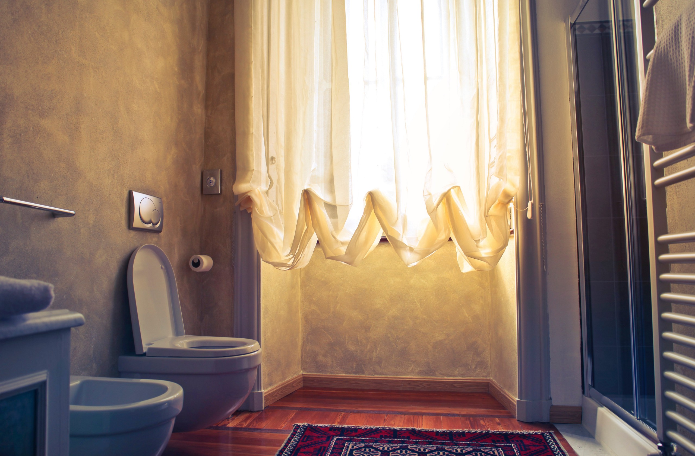

Photo by bruce mars from Pexels

The Universe has proven once again — there is no shortage of life lessons in the most unexpected places. For me, it all started a three weeks back. Up until that point, I thought very little about my toilet (as I should). My most memorable recollection was installing a soft close cover on it so it wouldn’t bang when I put the seat down. Otherwise, it was just like every other toilet — white, round and a great place to browse your phone.

So what lessons could I possibly learn from this familiar household item? Allow me to offer the following [allegory](https://www.google.com/search?q=allegory).

As many of you know, I dabble in a some [house hacking](https://medium.com/effai-me/surprise-unintended-consequences-of-airbnb-hosting-53c7a6122982). I rent out my basement on Airbnb to random people on the internet. On Sunday I got the following lovely message from my guests: “the toilet isn’t flushing”. Thankfully, there was nothing in there I couldn’t handle. I headed downstairs, pulled out the plunger and started plunging vigorously. I plunged for about an hour. I tried all sorts of techniques. I put hot water in there. I put soap in there. I ended up with a bowl full of hot soapy bubbles. Eventually, I had to admit that I needed professional help.

I called the first plumber I could find on Google. He showed up within a few hours looking ready to unclog some pipes. He started with the auger (long wire you stuff in the toilet). He stuck it in there, rotated it a bunch of times but no luck. He removed the toilet off the floor and tried again. Still no luck. All I could think was “What the hell did those hippies flush down my toilet?”.

He mentioned we’re going to need some more heavy duty equipment. Keep in mind that I have Airbnb guests in my house with a dysfunctional toilet. They are not going to be very happy. On top of it, I live in an old house. Our pipes are… questionable. How much is this going to cost me? I am now quite nervous.

We brought down a 400 pound roll of metallic tubing. He stuck it in the pipe and started unwinding it in. He kept going all the way to the end. When he pulled it out, we found an extension cord wrapped around the metallic tubing.

As we both stood there scratching our heads wondering how this is even possible, my wife was still thinking straight. She Googled it quickly and identified it as a part of our sewage pump. Turns out if your toilet is below the sewage line, you need a pump to get the waste out (makes sense once you think about it). The plumber must have ripped off the cord while digging for clogs.

He put the toilet back in place; Charged me $350; told me I need to get a qualified professional and bounced.

I started to frantically call anyone who could possibly help. I needed this done ASAP. We have paying customers in the house who need to … use the facilities. The best I could do is get a guy to show up in two days. The estimate for a replacement was $1600.

I don’t know if you’ve ever dealt with plumbers, electricians or any general maintenance workers but they aren’t exactly known for being reliable.

That night, I couldn’t sleep. I was worried the plumber wouldn’t show; replacing the pump wouldn’t fix the issue; or that it would escalate to more problems. I woke up the next day with a big headache — exhausted and stressed.

On a whim, I decided to call the initial company and complain about the plumber; maybe they’ll offer me a discount. I dialed their number, and politely explained what happened. Instead of a discount, they offered to fix the pump for free. Another plumber showed up later in the day, replaced the pump within an hour and charged me nothing for labour and material.

Once he finished, I rushed downstairs and started flushing that toilet over and over. Flushing never felt so good. The next night, I slept like a baby. I don’t remember the last time I slept that well. I woke up refreshed, feeling great, ready to take on the world.

What really inspired this story is how vividly I remember the difference in those two days. When the toilet was broken and everything seemed like an endless series of disasters, life was hard — I was stressed and miserable. Dealing with this shit (pun intended) was not fun. Once the toilet service was restored, my life was turned upside down. I felt free. I felt good. I felt like anything was possible. In short life was glorious again. What a difference 24 hours can do for your well being.

More importantly, I recognized how much we take for granted. As long as this toilet was working, I never paid attention to it. I pulled the lever down. The water flushed away all my troubles. Life went on. However, once this process failed, my outlook changed. All of a sudden my house wasn’t this impenetrable castle but a money pit. And running that Airbnb wasn’t a license to print money but just a bunch of hassles.

Granted, I did not feel like that for long. Once everything was fixed and settled, I was more than happy to take my guests’ money for the right to stay in my basement (I did offer a free night for the trouble). Also, I ended up getting a brand new sewage pump installed for a bargain price.

Upon reflection, I had to ask myself the following question:

> What can I do to experience life like I did on Monday, everyday?

In other words, how can I wake up feeling refreshed and energized, all worries alleviated and the anxiety extinguished. Turns out my experience that week is a common phenomena encountered regularly. In fact, we even have an aphorism to explain what happened:

> “You don’t know what you have until it’s gone”

Duh. Everyone knows that. But what can we do about it?

One thing I could do is sabotage my plumbing on regular basis and deal with the plumber while my Airbnb guests are watching. I don’t think it’s a scalable solution though so I wouldn’t recommend it.

Another option is to practice what is usually referred to as “gratitude journaling”. [Sonja Lyubomirsky](http://thehowofhappiness.com/) talks extensively about this technique in her book, “The how of happiness”.

[**The How of Happiness: A New Approach to Getting the Life You Want**  
_Learn how to achieve the happiness you deserve"A guide to sustaining your newfound contentment." --Psychology TodayYou…_www.amazon.com](https://www.amazon.com/How-Happiness-Approach-Getting-Life/dp/0143114956/ref=sr_1_2?ie=UTF8&qid=1535605491&sr=8-2&keywords=the+how+of+happiness "https://www.amazon.com/How-Happiness-Approach-Getting-Life/dp/0143114956/ref=sr_1_2?ie=UTF8&qid=1535605491&sr=8-2&keywords=the+how+of+happiness")

It entails taking two minutes out of your day (or week) to write down 3 things you’re thankful for. It can be anything. It can be as mundane as catching the bus on time or as significant as getting promoted at work or as pivotal as getting engaged. The key to this exercise is to regularly consider all the things you’re thankful for and consciously become a more grateful person.

I’ve known about this method for years. Yet somehow, this spiritual, new age approach never resonated with me. I would imagine people sitting in a circle, humming, holding their energy crystals with one hand and writing in their journals made of recycled fabrics with the other.

If the above doesn’t appeal to you, feel free to drop all the spiritual moonshine and concentrate on the psychological benefits. The root act is simple. Think about what you’re thankful for; be grateful, write it down. Repeat tomorrow.