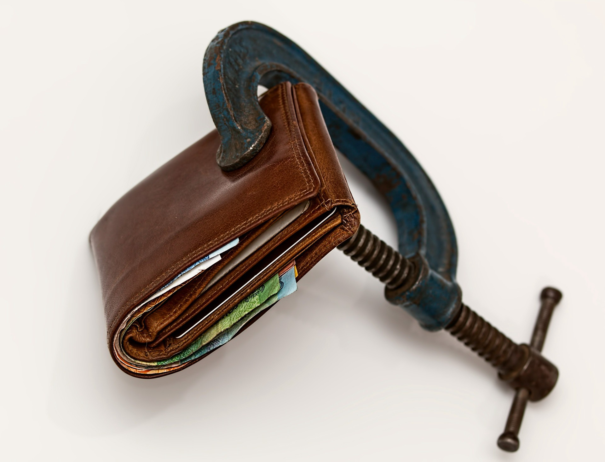

My employer offers many generous perks. One of them is called an ESPP or employee stock purchase plan. It is a scheme by which the employer incentivizes you to purchase its stock using a portion of your salary. The incentive is usually some sort of a discount or top up.

One question that frequently comes up is what to do once the shares are vested into your account.

You can go down one of two roads. First, you can sell all the shares immediately and purchase something else. Spoiler alert, I’m in this camp.

Second, you can keep the shares.

The reasoning for keeping the shares is actually quite solid. If you’ve made money on the stock market and you’ve held the shares for less than a year, you are subject to good old fashion **income** tax. If, on the other hand, you held it for more than a year, you are subject to shiny new **capital gains** tax; and you guessed it, the shiny new capital gains taxes are usually lower.

This is exactly the argument I was having with my friend Aaron at work yesterday. Our shares from ESPP are set to vest in November and he was inquiring about my plans for the money. I told him I was going to sell everything and purchase a boring and dull index fund. He told me I was crazy for throwing my money away.

This discussion went on for longer then I am ready to admit but I thought I can summarize the lessons here. Also, since this is my blog, my opinion is right.

Let’s start with an example: Since Aaron is a well paid executive of a small company, his household income is $300,000. That puts Aaron at the 24% tax bracket. Aaron’s company offers a 15% discount on the share price. Finally, Aaron commits $20,000 to the ESPP plan.

First, it’s important to note that only your gains are taxed — not your entire investment. In this case, if you were to sell the shares immediately after vesting, your discount would be your only gain. In other words, 15% of $20,000 or $3000.

Second, uncle Sam would come calling for his portion of those $3000 at the end of the year. His share would be 24% of $3000 or $720 — that’s what you owe the government.

Third, if you were to keep the shares for a year, you are still not scot-free. The capital gains tax is still 15% of $3000 or $450.

By holding on to the shares for an entire year, you’ve saved yourself less than $270 ($720 minus $450) or roughly 1% of the entire sum. To put that into perspective, my company’s stock went down 4% yesterday (and up 17% today).

I don’t know about you but that does not seem like a good deal to me. Putting money in a single company is notoriously volatile. Doing it with the company you work for is a [potential disaster](https://www.wsj.com/articles/SB1008712386485424000).

Of course, this is a somewhat contrived example. There are many other things to take into account

1.  If you’re filing individually and earning above $200,000, the **gap** between the income tax and capital gains tax is 20% instead of 9%. If you’re earning $38,000, the gap is actually negative (the income tax is lower). You can find the latest rates [here](https://www.nerdwallet.com/blog/taxes/capital-gains-tax-rates/).
2.  If you contribute significantly more than $20,000 into the ESPP program your tax loss might be greater. Of course, that also means you must keep more money in a single stock.
3.  If the incentive from your employer is larger, your tax could be greater. For example, when purchasing ESPP shares, my employer uses either the price today or the one from 6 months ago — whichever one is lower. As of this writing, the stock is up 10% from 6 months ago. My taxable gain is now higher.

It is worth evaluating your exact situation to determine how much money you are actually saving.

Also, I don’t want to imply that saving a couple of hundred bucks isn’t worth the time — it certainly is. I will gladly give my insurance company a call if it saves me money. That lizard has been good to me.

However, these savings don’t come for free. You are leaving a significant amount of money in a stock that you may or may not want to own.

Therefore; my advice to you is this. Sell the damn shares. Put them in [betterment](https://www.betterment.com/invite/alontager). You can thank me later.