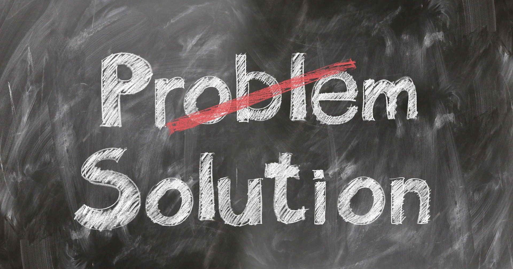
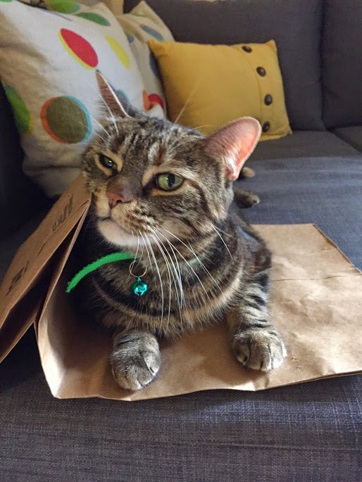

Money doesn’t buy you happiness. Unless, of course, you believe [this](https://www.pnas.org/content/107/38/16489) study where $75,000 could. Or maybe, if you are enlightened and in the pursuit of financial independence, [you don’t even think that’s necessary](https://www.mrmoneymustache.com/2012/09/06/does-peak-happiness-really-come-at-75000year/). It is certainly a convenient belief.

It is also reassuring monetarily. It is not easy to keep making more and more money. If our happiness depended on ever higher incomes, we’d be stuck in the rat race forever. Financial independence would be out of the question.

It also seems to be true from observation. There’s no shortage of miserable rich folks — at least in the media.

What if we looked at our own happiness? There is probably little correlation between that and our income level.

Does that mean we should all stop striving for more money? Probably not. One good reason to earn more money is that financial independence will come sooner. [Buying time does seem to promote happiness](https://www.pnas.org/content/114/32/8523.full).

But there’s another reason why money **can** increase your happiness — and there’s a million ways we fail to take advantage of it.

> Money can make your problems go away. Not everything. But a significant portion.

Okay… but you are already doing this.

Cooking is a chore so you pay someone to do it.

Cleaning is a chore so you pay someone to do it.

Taking care of your elderly parents is a chore so you pay someone to do it.

The problem is that as people start earning more money, they spend more. Instead of using that money to solve their problems, they inflate their life style. As the old adage goes, “Mo’ money mo’ problems”.

When you bought your starter home, cleaning wasn’t really a chore. You were just excited to have a house. Now that you have 2 kids, a husband and 3000 square feet, things are different. All of a sudden you need to hire a maid and gardener. You are too busy with your career after all. And there’s this whole argument for [specialization](https://study.com/academy/lesson/specialization-in-economics-definition-lesson-quiz.html) too.

This is commonly referred to as “Lifestyle inflation” and it is the most destructive force in the universe.

The unfortunate reality is that all these problems come bundled with a healthy dose of lifestyle inflation. It’s unavoidable. Anything you add to your life comes at a cost. There’s the monetary upfront cost. But there’s also the recurring maintenance cost (take a look at my [second law of minimalism](https://medium.com/effai-me/second-law-of-minimalism-c487f90a8ff3) for further discussion).

Solving this class of problems by throwing money at them simply brings you back to baseline.

### Can we do better?

Turns out, there’s a second class of problems; equally common and just as lethal. They tend to have the following properties:

1.  They appear unexpectedly.
2.  They tend not to repeat.
3.  Their cost to resolution varies significantly.

We usually refer to these as “accidents” or “fuck ups”. And this is where having money really shines. When you throw money at fuck ups, the problems frequently go away but your lifestyle doesn’t change. It is still the same you.

This is also where $75,000 comes in. It happens to be enough money to cover your basic needs such as food and shelter. You can afford to go out a couple of times a month to a dinner and a movie. You can even take your 3 weeks of vacation in a tropical paradise. And it leaves you with enough breathing room to cover some accidents.

I’ve experienced the fruits of this last year when my cat got sick. We had to take her to the vet and operate on her. The bills were in the thousands. I remember swiping my credit card and telling the vet to do whatever was necessary. It wasn’t the place nor time to think about the money. This was clearly a problem of the second nature.

Looking back, I can acknowledge that being able to afford the operation made me a happier person. It is not because she survived — she didn’t. It is because I couldn’t live with myself if she died and I didn’t do everything I could to save her.

The examples don’t have to be this extreme. Maybe you just got a parking ticket. Do you really want to take the time to go to court? Or call someone? Or maybe you can pay the fine and move on with your day.

This is probably a somewhat inconvenient truth to many who are seeking financial independence on a miniature budget. The reality is that accidents happen. Yes, they often have a non-financial solution. But there’s always a trade-off.

Use that money but use it wisely. Because using money, your life can become drastically simpler — reducing the downside while keeping all the upside. But it comes at a price.

Meowmix