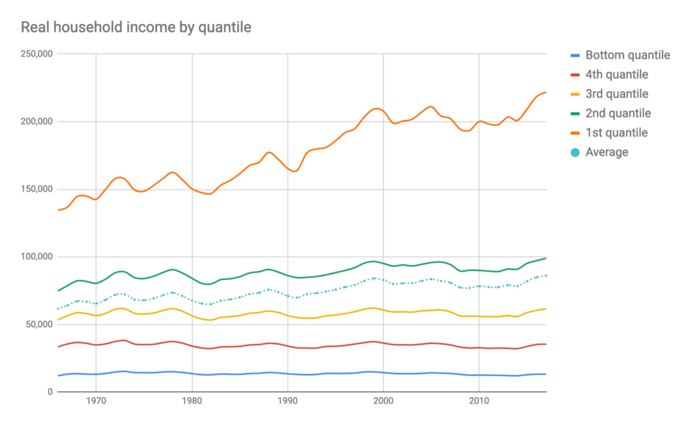

I picked up Robert Reich’s “[Saving Capitalism — For the many, not the few](https://www.amazon.com/gp/product/0345806220?pf_rd_p=019ad97c-f176-43be-96b9-991a6dc65763&pf_rd_r=QZHN3H2RPCG1ZM2WAKBN)” at a semi-annual book sale run by the Seattle Public Library. I didn’t think capitalism needed saving but I couldn’t resist the bright orange cover and the provocative title. And who knows? Maybe the former secretary of labour has something interesting to say.

I read the book on my patio, cover to cover, in about a week — a personal best for a full length book. I couldn’t put it down for one simple reason. I thought he was wrong and it made me angry. At the end of every chapter I would barge in to the house and pronounce to my wife that “this guy is an idiot”.

Take for instance the chapter titled “The Meritocratic Myth” where Mr. Reich talks about the nation’s blue-collar laborers and how they could potentially earn thirty dollars an hour in today’s dollars working a factory job — and that’s without a high school degree. We commonly refer to those days as the golden age of America - when a high school teacher could provide their families with a solid middle class life.

Or how about the chapter “The declining bargaining power of the middle”? Mr. Reich provides us with a handy graph demonstrating how starting in 1970, the real hourly compensation completely stagnated.

This is a common and often regurgitated discourse we hear when it comes to income inequality and the constantly disappearing middle class. But is it actually that simple? Allow me to contribute my two cents.

I will address the wage difference first. It’s true that the factory jobs are long gone but we have plenty of other entry level jobs available to compare. McDonald’s and Walmart are common targets for workers demanding higher wages so I will use these companies.

Take a look at McDonald’s income statement. This evil corporation made four billion dollars last year in profit. Why won’t they raise wages?

Because there is no way McDonald’s or Walmart could ever afford to pay their workers thirty dollars an hour. If McDonald’s went up to twenty dollars an hour, their two hundred thousand U.S. workers would cost the company an additional four billion dollars — that’s every penny they made this year. Walmart wouldn’t even survive at fifteen dollars an hour with their two million workers. And this is during an economic boom. Imagine what would happen during a recession.

What about the indisputable maxim that the rich get richer while the poor get poorer ?— something Mr. Reich himself mentioned towards the end of the book.

First, who are the rich? Is it the one percent? Is it the five percent?

Second, what does the data actually say?

I pulled some [numbers](https://docs.google.com/spreadsheets/d/1iKB9xQEJIGBapRO0j1slj_qoajqCsXpYZmUvr9aJOcw/edit?usp=sharing) from [census.gov](https://www.census.gov/programs-surveys/decennial-census/2020-census.html) because I don’t trust pre-compiled charts online and plotted it. This is what I got:

Turns out the bottom three quantiles haven’t been doing all that great since 1967 — their household income has been mostly flat. But notice that no one got poorer. The incomes of the bottom three quantiles have been solidly within the same range (with a very slight uptrend).

What about the top two quantiles. They are certainly getting richer. Way richer. This is good news for about 40 percent of all households in America — that’s a lot of households. This is not to excuse the state of the bottom 60 percent — things are still rough if you’re in the bottom half. However, they aren’t necessarily worse off than during the “Golden Age”.

My original plan was to go through the book, page by page and point out all the half truths Mr. Reich used to make his case. Half way through writing this, I decided to take a different approach. I’ve decided to focus my wrath on a single recurring idea.

But first, let me digress for a moment.

This may surprise you but Mr. Reich is one hundred percent right on the central theme of the book — crony capitalism is the root cause of all our problems in the economy.

Rules must be broad, simple and just. Unfortunately, Mr. Reich has many examples when the rules are exactly the opposite — narrow, complex and unjust. Things like CEO pay and lobbyists tilt the system in favour of the rich and well connected.

This problem with power asymmetry can be addressed in two ways. First, the government can set up (more) rules that would limit the influence of corporations and other groups with vested interests in the political process. This is something that we see day to day. Calls for regulating A or banning B is the standard approach. I can understand why. It is easy to set up rules and let someone else deal with the unintended consequences.

Second, you can limit the power of the government to enact narrow, complex and unjust rules. Lobbying would immediately lose its power as the payoff to these activities would disappear.

Mr. Reich focused the book on the first solution but completely neglected the second. His suggestions would encourage the government to limit the power of select groups through rules and regulations. This in turn makes lobbying for exception and campaigning for exclusions by corporations and well connected individuals that much more lucrative —exactly what he was trying to avoid.

Despite my criticism of the book, I would highly recommend reading it. It is well written and thought provoking. There is also a convenient accompanying documentary on Netflix for the visual learners. Exposing yourself to ideas that don’t line up with your own biases is extremely important. It’s the only way to avoid echo chambering yourself into conviction of your own ideas.

For instance, while writing this article, I discovered that the bottom three fifths of American households aren’t doing significantly better than 50 years ago — at least when it comes to household income. That was a surprise to me. I honestly thought everyone were strictly better off. Armed with this new knowledge, I must admit that Mr. Reich turned out to be “not a complete idiot”.

Regarding the reasons for this lack of growth, I have some theories about that but I’ll save that for another article.

[Saving Capitalism — For the many, not the few](https://www.amazon.com/gp/product/0345806220?pf_rd_p=019ad97c-f176-43be-96b9-991a6dc65763&pf_rd_r=QZHN3H2RPCG1ZM2WAKBN)